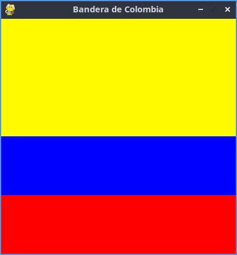

# Estructura de un juego en pygame

## Inicialización 

- Como en todo programa en python se debe importar los módulos o librerias a utilizar. 
`import pygame`

- Inicializar pygame usando la función init(). Inicializa todos los módulos de pygame iportados.
`pygame.init()`

## Visualización de la ventana

`ventana = pygame.display.set_mode((600, 400))`

- set_mode() es la función encargada de definir el tamaño de la ventana. En el ejemplo se esta definienfo una ventana de 600 px de ancho y 400 px de alto.

`pygame.display.set_caption("Mi ventana")`

- set_caption() es la función que añade un titulo a la ventana.

### Función set_mode().

`set_mode(size = (0,0), flags = 0, depth = 0, display = 0)`

- size = (600,400) : define el tamaño de la ventana.

- flags: define uno o más comportamienetos para la ventana.
    - Valores:
        - pygame.FULLSCREEN.
        - pygame.RESIZABLE.
    - Ejemplo:
        - flags = pygame.FULLSCREEN | pygame.RESIZABLE: pantalla copleta, dimenciones modificables. 

## Bucle del juego - game loop.

- Bucle infinito que se interrumpirá  al cumplir ciertos criterios.

- Reloj interno del juego.

- En cada iteración del bucle del juego podemos mover a un personaje, o tener en cuenta que un objeto a alcanzado a otro, o que se a cruzado la linea de llegada lo que quiere decir que la partida a terminado.

- Cada iteración es una oportunidad para realizar todo las datos relacionados con el estado actual de la partida.

- En cada iteracion se realizan las siguientes tareas:

    1. comprobar que no se alcanzan las condicones de parada, en cuyo caso se interrumpe el bucle.

    2. Actualizar los recursos nesesarios para la iteracion actual.

    3. Optener las entradas del sistema, o la interacción con el jugador.

    4. Actualizar todas las entidades que caracterizan el juego.

    5. Refrescar la pantalla.

## Superficies pygame

- Superficie:
    
    - Elemento geométrico

    - Linea, poligono, imagen, texto que se muestra en la pantalla

    - El poligono se puede o no rellenar de color

    - Las superficies se crean de diferente manera dependiendo del tipo: 

        - image: image.load()
        
        - texto: font.render()

        - Superficie generica: pygame.surface()

        - Ventana del juego: pygame.display.set_mode()

### Bandera de Colombia

```Python
#importamos la libreria pygame
import pygame

#inicializamos los módulas de pygame
pygame.init()

#establecer titulo ala ventana
pygame.display.set_caption("Bandera de Colombia")

#establecer dimenciones de la ventana
ventana = pygame.display.set_mode((400,400))

#definir un color
amarillo = (255, 250, 0)
azul = (0,0,255)
rojo = (255,0,0)

#crear una superficie(tamaño de la franja)

color_amarillo = pygame.Surface((400,200))
color_azul = pygame.Surface((400,100))
color_rojo = pygame.Surface((400,100))

#rellenamos la superficie de azul
color_amarillo.fill((amarillo))
color_azul.fill((azul))
color_rojo.fill((rojo))


#muevo la superficie en la ventana(coordenadas de la franja)
ventana.blit(color_amarillo, (0,0))
ventana.blit(color_azul, (0,200))
ventana.blit(color_rojo, (0,300))

#actualiza la visualizacion de la ventana
pygame.display.flip()

#bucle del juego

while True:
    event = pygame.event.wait()
    if event.type == pygame.QUIT:
        break

pygame.quit()
```



## Gestión de tiempo y los eventos

### Módulo time

- Este módulo ofrese varias funciones que permiten cronometrar la sesión acual (desde el init()) o pausar, la ejecución, por ejemplo.

- Funciones:

    - pygame.time.get_ticks

    - pygame.time.waitpygame.time.delay

- Objeto Clock
    - La función tick permite actualizar el reloj asociado con el juego actual.
    
    - Se llama cada vez que se actualiza la pantalla del juego

    - Permite especificar el número maximo de fotogramas que se muestran por segundo y por tanto limitar y controlar la velocidad de ejecución del juego

    - Si insertamos en un bucle de juego la siguiente line, garantizamos que nunca sera más rapido de 50 fotogramas por segundo:`Clock.tick(50)` 

### Gestión de eventos

- Hay diferents formas  para que el programa sepa que se ha desencadenado un evento

- Es esencial que los programas puedan conocer inmediatamente las acciones del jugador  a traves del teclado, el mouse, el joystick o culquier otro periferico

#### Función pygame.event.get

- permite obtener todos los eventos en espera de ser procesados y que estan disponibles en una cola

- Si no hay ninguno, se obtiene una colección vacia

```Python
#Usamos un bucle for para recorrer todos los eventos de la colección obtenida al llamar la función get
for event in pygame.event.get():
    if event.type == pygame.KEYDOWN:
        if event.key == pygame.K_ESCAPE:
            parar_juego = True
```
#### Función pygame.event.wait

- Esta función espera que ocurra un evento, y en cuanto sucede, está disponible

```Python
#Usamos un bucle for para tecorrer todos los eventos de la colección optenida al allamar la finción get
while True:
    event = pygame.event.wait()
    if event.type == pygame.QUIT:
        break
```

#### Función pygame.event.poll

- Devuelve solo uno de los eventos de la cola de espera

## Sonidos en pygame

- pygame.mixer : módulo que permite la gestión del sonido

- music : submodulo que gestiona la musica de fondo. Necesariamente solo hay uno a la vez

- Sound: objeto de mixer, que se puede instanciar varias veces para usarlo en efectos de sonido del juego

### Archivos de sonido

- Se reccomiendo usar 2 formatos principalmente:
    
    - Formato WAV(Waveform Audio File Format)

    - Formato abiento y gratuito OGG

### Canne (canal) en Pygame

- Un juego tiene varios canales de sonido

- Se puede asignar un sonido al canal número 1 y otro diferente al número 2

- Entonses es posible reproducir sonidos simultaneamente activando la lectura en diferentes canales

## Sprites

- Objeto que asocia una ubicación, una representacaión gráfica (esta o aquella imagen, por ejemplo) y un conjunto de propiedades

- Estas propiedades puedes ser un nombre, un texto, valores buuleanos que caracterizan el objeto en cuesntión (por ejemplo si el objeto se puede mover o no)

- Una posible traduccion del termino sprite podria ser "imagen-objeto" que se actualiza con cada actualizacion del bucle del juego

- Cuanto más complejo es el juego más objetos grafico tiene que gestionar y actualizar lo que puede ser tedioso

- Pygame usa no solo la nocion de sprites sino tambien de grupos de sprites(group)

- La nocion de group permite agrupar los objetos del mismo tipo. Ejemplo: todos los soldados de un ejercito lo que se entiende como una coleccion de instancias de una clase Soldado.

- Un determinado procesamiento se puede aplicara un conjunto o subconjunto de sprites. Ejemplo: cambiar el color de todos los enemigos o hacer invisibles algunos objetos